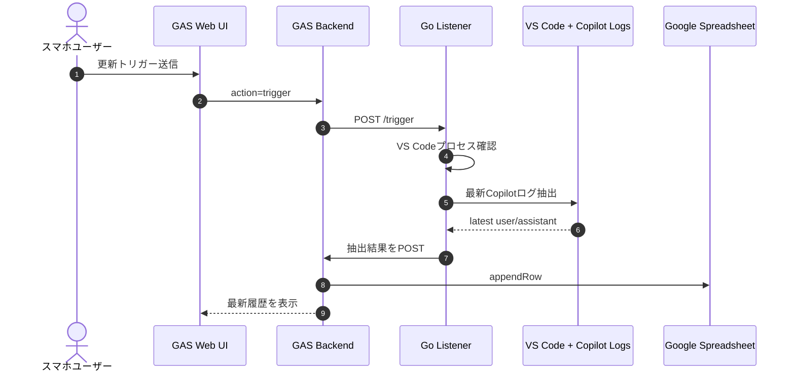

# vscopilot

PC上のVS Code + GitHub Copilot Chatを、スマホ経由で監視/トリガーするためのMVPです。

## 実現すること（MVP）

1. スマホからGAS画面の「更新トリガー送信」を押す。
2. GASがGoリスナーの`/trigger`を呼ぶ。
3. GoリスナーがVS Codeプロセス確認 + Copilot Chatログ抽出を実施。
4. 抽出結果をGAS APIにPOST。
5. GASがスプレッドシートへ保存し、Web画面で表示。

## フロー図（認識確認用）



## 構成

- Go listener: `cmd/listener/main.go`
- Copilot log reader: `internal/copilot/reader.go`
- Payload struct: `internal/bridge/types.go`
- GAS backend: `gas/Code.gs`
- GAS frontend: `gas/Index.html`

## 前提

- Go 1.22+
- Googleアカウント
- GASと紐づくGoogle Spreadsheet
- スマホからアクセス可能なGAS Web App URL
- Goリスナーが外部から到達可能であること
	- 例: Tailscale Funnel / Cloudflare Tunnel / ngrok / 固定IP + ポート開放

## Goリスナー起動

```bash
cd /workspaces/vscopilot
go run ./cmd/listener
```

環境変数:

- `GAS_WEBHOOK_URL` (必須): GASのWeb App URL
- `TRIGGER_TOKEN` (任意): `/trigger` 呼び出し時の共有トークン
- `LISTEN_ADDR` (任意): 既定 `:8080`
- `COPILOT_LOG_ROOTS` (任意): Copilotログ探索ルートを `:` 区切りで上書き

例:

```bash
export GAS_WEBHOOK_URL="https://script.google.com/macros/s/xxxxx/exec"
export TRIGGER_TOKEN="your-secret"
export LISTEN_ADDR=":8080"
export COPILOT_LOG_ROOTS="$HOME/.config/Code/User/workspaceStorage:$HOME/.vscode-remote/data/User/workspaceStorage"
go run ./cmd/listener
```

## GASセットアップ

1. 新規Google Spreadsheetを作成。
2. 拡張機能 > Apps Script を開く。
3. `gas/Code.gs` を `Code.gs` に貼り付け。
4. `gas/Index.html` を新規HTMLファイル `Index` として追加。
5. Apps Scriptのプロジェクト設定で Script Properties を設定:
	 - `GO_TRIGGER_URL`: 例 `https://<your-go-endpoint>/trigger`
	 - `TRIGGER_TOKEN`: Go側と一致させる
6. デプロイ > 新しいデプロイ > 種類: ウェブアプリ
	 - 実行ユーザー: 自分
	 - アクセス: 必要に応じて制限
7. 発行されたWeb App URLを `GAS_WEBHOOK_URL` としてGoに設定。

## エンドポイント

Go:

- `GET /health`
- `POST /trigger`
	- Header: `X-Trigger-Token`（`TRIGGER_TOKEN` を使う場合）

GAS:

- `POST` (action省略): Goからのログ保存
- `POST` with `{ "action": "trigger" }`: GASからGoへトリガー転送
- `GET`: 一覧表示UI

## 次段階（予定）

GASフォームから入力したメッセージをVS Code Copilot Chatへ送る機能を追加します。

候補アプローチ:

1. VS Code拡張を作成し、ローカルHTTPまたはWebSocket経由で入力を受け取ってChatに投入。
2. 既存ログ監視に加えて、入力キュー（SpreadsheetやFirestore）をGoがポーリングし、VS Code側コンパニオンに中継。

このMVPではまず「取得・保存・表示・トリガー送信」を安定させることを優先しています。
